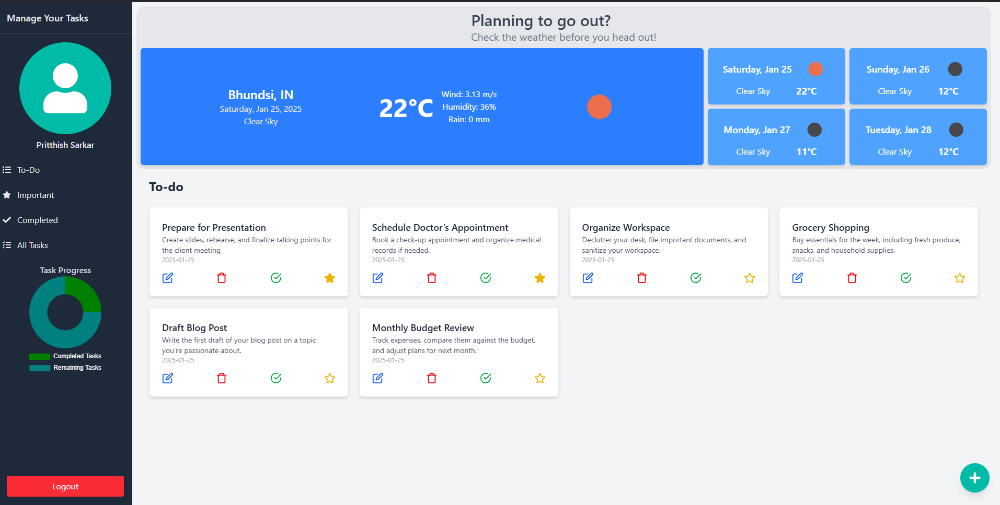
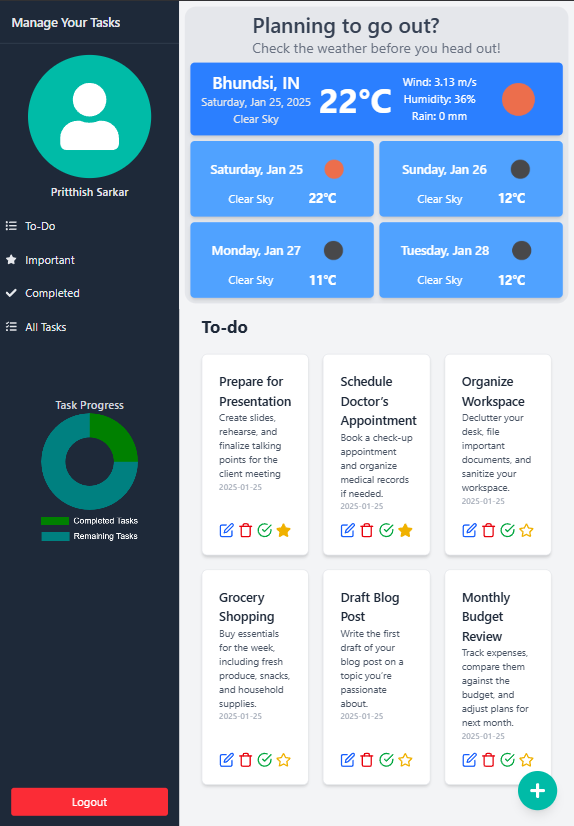
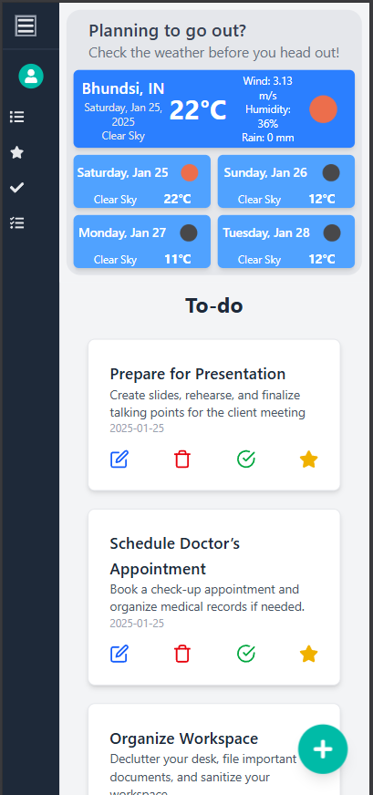

# Todo App with Weather Feature 🌦️

A modern and responsive Todo web application built using **React** and **Redux**. This app combines task management with weather insights, offering a seamless and productive user experience.

## Features 🚀

- **Todo Management**:
  - Add, edit, and delete tasks.
  - Mark tasks as complete or incomplete.
  - Persisted state ensures todos are stored locally for consistent access.

- **Weather Integration**:
  - Displays current weather and 4-day forecasts.
  - Weather data is cached using **Redux Thunks** for efficient API requests.

- **Responsive Design**:
  - Fully functional across all screen sizes—desktop, tablet, and mobile.

---

## Tech Stack 🛠️

- **React**: Frontend library for building the UI.
- **Redux**: State management.
- **Redux Thunks**: Middleware for async actions and API caching.
- **Local Storage**: Persisted state for todos.

---

## Screenshots 📸

### Desktop View


### Tablet View


### Mobile View


## Usage 📝

- **Add a Todo**: Type your task in the input box and press **"Add Task."**
- **Mark Important and Done**: Mark important tasks and complete tasks pressing icons.
- **Check Weather**: The weather panel displays the current day’s weather and a 4-day forecast.
- **Responsive UI**: Enjoy a seamless experience on all devices.


---

## Installation 💻

1. Clone the repository:
   ```bash
   git clone https://github.com/Pritthish20/todo.git

2. Navigate to the project directory::
   ```bash
   cd todd


3. Install dependencies:
   ```bash
   npm install


4. Install dependencies:
   ```bash
   npm run dev